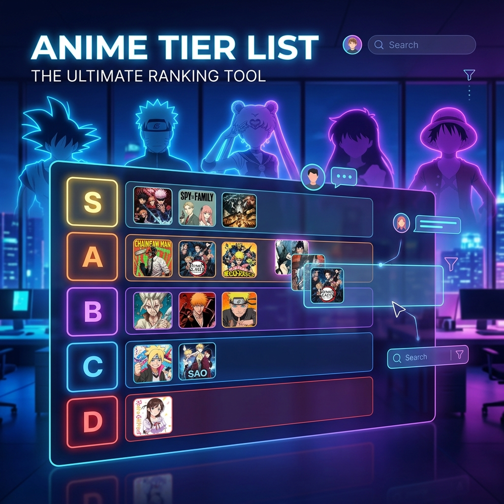

# 🌟 Anime Tier List - Winter 2026



A real-time, collaborative anime ranking application built with **React**, **Vite**, and **Firebase**. Rank your favorite Winter 2026 anime together with your friends in real-time!

## ✨ Features

- 🤝 **Real-time Collaboration**: See other users' cursors and actions as they happen.
- 🎨 **Dynamic UI**: Beautiful, interactive drag-and-drop system for ranking.
- ⏱️ **Moderation System**: Prevent trolling with built-in cooldowns and AFK detection.
- 📊 **AniList Integration**: Automatically fetches the latest anime from AniList API.
- 📱 **Mobile Friendly**: Responsive design that works great on all devices.

## 🚀 Tech Stack

- **Frontend**: React 19, Vite, TailwindCSS
- **Real-time Backend**: Firebase (Firestore & Realtime Database)
- **Data Source**: AniList GraphQL API
- **Icons**: Lucide React

## 🛠️ Installation & Setup

1. **Clone the repository**:
   ```bash
   git clone https://github.com/yourusername/animetierlist.git
   cd animetierlist
   ```

2. **Install dependencies**:
   ```bash
   npm install
   ```

3. **Configure Environment Variables**:
   Create a `.env` file in the root directory and add your Firebase credentials:
   ```env
   VITE_FIREBASE_API_KEY=your_api_key
   VITE_FIREBASE_AUTH_DOMAIN=your_auth_domain
   VITE_FIREBASE_DATABASE_URL=your_database_url
   VITE_FIREBASE_PROJECT_ID=your_project_id
   VITE_FIREBASE_STORAGE_BUCKET=your_storage_bucket
   VITE_FIREBASE_MESSAGING_SENDER_ID=your_messaging_sender_id
   VITE_FIREBASE_APP_ID=your_app_id
   ```

4. **Run the development server**:
   ```bash
   npm run dev
   ```

## 📜 Database Rules

Make sure to set up your Firebase security rules using the provided `firestore.rules` and `database.rules.json` files for proper security.

## 📄 License

This project is licensed under the MIT License - see the [LICENSE](LICENSE) file for details.
